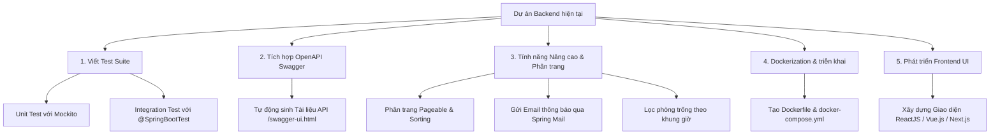

# BÁO CÁO ĐÁNH GIÁ & KẾ HOẠCH DỰ ÁN (PROJECT REVIEW PLAN)
## Dự án: Hệ Thống Quản Lý Đặt Phòng Họp (Meeting Room Booking System Backend)

---

## 1. TỔNG QUAN DỰ ÁN (PROJECT OVERVIEW)
- **Tên dự án**: Meeting Room Booking System Backend (`booking_system`)
- **Ngôn ngữ & Framework**: Java 21, Spring Boot 3.4.2
- **Cơ sở dữ liệu**: PostgreSQL
- **Hệ thống quản lý thư viện**: Apache Maven
- **Mô hình kiến trúc**: Kiến trúc phân tầng (Multi-tier Architecture: Controller → Service → Repository → Model/Entity) kết hợp DTOs (Data Transfer Objects) và Spring Security JWT.

---

## 2. CÔNG VIỆC ĐÃ THỰC HIỆN (COMPLETED TASKS)

### 2.1. Xây dựng Cấu trúc Dự án & Mô hình Dữ liệu (Models & JPA Entities)
- `User.java`: Entity quản lý thông tin người dùng (Họ tên, Email, Mật khẩu đã mã hóa, Vai trò).
- `Role.java`: Enum định nghĩa phân quyền người dùng (`ROLE_USER`, `ROLE_ADMIN`).
- `Room.java`: Entity thông tin phòng họp (Tên phòng, Sức chứa, Vị trí, Mô tả).
- `Booking.java`: Entity lưu thông tin đặt phòng (Liên kết User & Room, Thời gian bắt đầu, Thời gian kết thúc, Trạng thái).
- `BookingStatus.java`: Enum quản lý vòng đời đơn đặt phòng (`PENDING`, `CONFIRMED`, `CANCELLED`, `REJECTED`).

### 2.2. Xây dựng Hệ thống Bảo mật & Xác thực (Security & JWT Authentication)
- `SecurityConfig.java`: Cấu hình Spring Security 6 với session vô trạng (Stateless), mã hóa mật khẩu BCrypt và phân quyền API.
- `JwtTokenProvider.java`: Tạo, giải mã và xác thực mã Token JWT (HMAC-SHA256).
- `JwtAuthenticationFilter.java`: Interceptor kiểm tra Header Bearer Token trên mỗi HTTP request.
- `UserPrincipal.java` & `CustomUserDetailsService.java`: Tích hợp User Entity với `UserDetails` trong Spring Security.

### 2.3. Tầng DTO & Xử lý Ngoại lệ (DTOs & Exception Handling)
- **Data Transfer Objects (DTOs)**: 
  - Request DTOs: `RegisterRequest.java`, `LoginRequest.java`, `CreateRoomRequest.java`, `UpdateRoomRequest.java`, `CreateBookingRequest.java`.
  - Response DTOs: `AuthResponse.java`, `UserResponse.java`, `RoomResponse.java`, `BookingResponse.java`.
- `GlobalExceptionHandler.java`: Bắt lỗi tập trung (Validation errors, Authentication failures, Resource NotFound, Runtime Exceptions) và trả về định dạng JSON chuẩn.

### 2.4. Tầng Đặt Dữ liệu & Nghiệp vụ Business (Repositories & Services)
- **Repositories**: `UserRepository.java`, `RoomRepository.java`, `BookingRepository.java` (Viết các câu truy vấn JPQL custom để kiểm tra trùng thời gian đặt phòng `findOverlappingBookings`).
- **Services Implementation**:
  - `AuthServiceImpl.java`: Xử lý đăng ký (mã hóa password BCrypt) và đăng nhập (phát hành token JWT).
  - `RoomServiceImpl.java`: Quản lý CRUD thông tin phòng họp.
  - `BookingServiceImpl.java`: Kiểm tra tính hợp lệ của khung giờ, chống trùng lịch (double-booking detection), phân quyền người sở hữu khi hủy booking.

### 2.5. Tầng REST Controllers (API Outlets)
- `AuthController.java`: Endpoints Đăng ký (`/api/auth/register`) & Đăng nhập (`/api/auth/login`).
- `RoomController.java`: Endpoints Xem phòng (`/api/rooms`) và Quản lý phòng họp cho Admin (`POST`, `PUT`, `DELETE`).
- `BookingController.java`: Endpoints Đặt phòng (`POST /api/bookings`), Xem đơn cá nhân (`GET /api/bookings/my`), Xem lịch phòng (`GET /api/bookings/room/{roomId}`), Hủy đặt phòng (`PUT /api/bookings/{id}/cancel`).

---

## 3. KỸ NĂNG & CÔNG NGHỆ ĐÃ HỌC HỎI (SKILLS & TECHNOLOGIES LEARNED)

### 3.1. Kỹ năng Chuyên môn & Công nghệ (Hard Skills)
1. **Spring Boot 3 & Java 21 Modern Standard**:
   - Sử dụng Dependency Injection (DI) & Inversion of Control (IoC).
   - Áp dụng Java Record & Stream API cho việc xử lý dữ liệu sạch sẽ.
2. **Spring Data JPA & ORM Hibernate**:
   - Thiết kế ERD relational database (Mapping `@Entity`, `@Id`, `@Enumerated`, `@ManyToOne`).
   - Sử dụng JPQL (Java Persistence Query Language) xử lý bài toán tìm khoảng thời gian giao nhau (Time-overlap checking).
3. **Bảo mật RESTful Web API với JWT**:
   - Hiểu rõ cơ chế Stateless Authentication so với Cookie/Session traditional.
   - Triển khai Spring Security Filter Chain, `AuthenticationManager`, `PasswordEncoder` (BCrypt).
   - Phân quyền chi tiết dựa trên Roles (`ROLE_USER`, `ROLE_ADMIN`).
4. **Kiến trúc phần mềm Clean Architecture**:
   - Phân tách rõ ràng giữa Entity (Database object) và DTO (API contract object).
   - Áp dụng các quy chuẩn thiết kế RESTful API (HTTP Verbs: GET, POST, PUT, DELETE, HTTP Status Codes).

### 3.2. Kỹ năng Mềm & Tư duy Lập trình (Soft Skills & Problem Solving)
- **Tư duy giải quyết bài toán nghiệp vụ phức tạp**: Xử lý logic đặt phòng tránh xung đột thời gian (Double-booking prevention).
- **Tư duy thiết kế API an toàn**: Kiểm tra quyền truy cập tài nguyên (người dùng chỉ có thể hủy đơn đặt phòng của chính mình trừ khi là Admin).

---

## 4. ĐỀ XUẤT BỔ SUNG & PHÁT TRIỂN TƯƠNG LAI (RECOMMENDATIONS & ROADMAP)

### 4.1. Bổ sung Unit Test & Integration Test (Ưu tiên cao)
- **Mục tiêu**: Đảm bảo độ ổn định của hệ thống khi nâng cấp hoặc sửa đổi code.
- **Thực hiện**:
  - Sử dụng **JUnit 5** và **Mockito** để viết Unit Test cho `AuthService`, `RoomService`, `BookingService`.
  - Sử dụng `@WebMvcTest` kiểm tra các Controllers.
  - Sử dụng `@DataJpaTest` hoặc **Testcontainers** để test truy vấn Database PostgreSQL thực tế.

### 4.2. Tích hợp OpenAPI / Swagger UI
- **Mục tiêu**: Tự động tạo tài liệu API công khai cho lập trình viên Frontend dễ dàng tích hợp.
- **Thực hiện**:
  - Bổ sung dependency `org.springdoc:springdoc-openapi-starter-webmvc-ui` vào `pom.xml`.
  - Cấu hình Swagger UI để hỗ trợ nhập mã JWT Token trực tiếp khi chạy thử nghiệm API.

### 4.3. Phân trang (Pagination) & Sắp xếp (Sorting)
- **Mục tiêu**: Tối ưu hiệu năng khi danh sách phòng họp hoặc lịch sử đặt phòng tăng lớn.
- **Thực hiện**: Bổ sung tham số `Pageable` (`page`, `size`, `sort`) vào các API `GET /api/rooms` và `GET /api/bookings`.

### 4.4. Tính năng Tìm kiếm & Lọc Phòng Trống (Advanced Search)
- **Mục tiêu**: Nâng cao trải nghiệm người dùng.
- **Thực hiện**: Thêm API cho phép truyền vào `startTime` và `endTime` để trả về danh sách chỉ các phòng họp **còn trống** trong khoảng thời gian đó.

### 4.5. Dịch vụ Thông báo Qua Email (Email Notifications)
- **Mục tiêu**: Tự động thông báo cho người dùng khi đặt phòng thành công, bị từ chối hoặc khi hủy phòng.
- **Thực hiện**: Tích hợp `spring-boot-starter-mail` gửi email HTML thông báo bất đồng bộ (`@Async`).

### 4.6. Container hóa với Docker (Dockerization)
- **Mục tiêu**: Đơn giản hóa việc đóng gói và triển khai ứng dụng trên máy chủ hoặc đám mây (AWS, Heroku, Render).
- **Thực hiện**:
  - Tạo `Dockerfile` để đóng gói ứng dụng Spring Boot thành một Docker Image.
  - Tạo `docker-compose.yml` để chạy đồng thời PostgreSQL Container và Backend Container chỉ với một câu lệnh `docker compose up`.

---
*Báo cáo được tổng hợp tự động ngày: 31/07/2026.*
